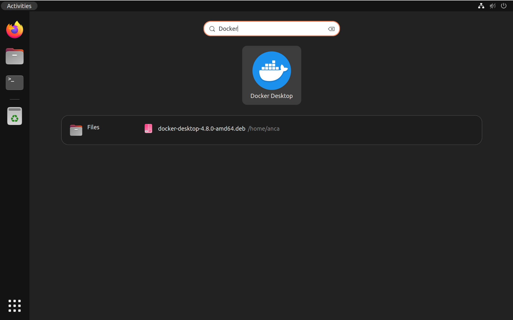
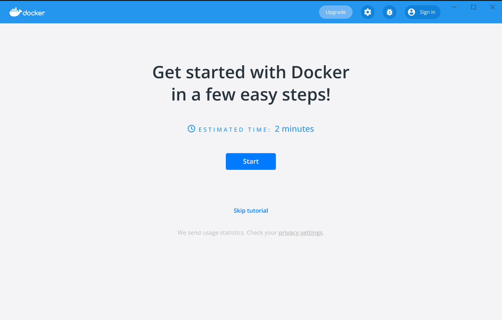

Welcome to Docker Desktop for Linux. This page contains information about system requirements, download URLs, and instructions on how to install and update Docker Desktop for Linux.

> Download Docker Desktop for Linux packages
>
> [DEB](https://desktop.docker.com/linux/main/amd64/docker-desktop-4.8.2-amd64.deb?utm_source=docker&utm_medium=webreferral&utm_campaign=docs-driven-download-linux-amd64){: .button .primary-btn }
> [RPM](https://desktop.docker.com/linux/main/amd64/docker-desktop-4.8.2-x86_64.rpm?utm_source=docker&utm_medium=webreferral&utm_campaign=docs-driven-download-linux-amd64){: .button .primary-btn }


## System requirements

To install Docker Desktop successfully, your Linux host must meet the following requirements:

- 64-bit kernel and CPU support for virtualization 

- KVM virtualization support. Follow the [KVM virtualization support instructions](#kvm-virtualization-support) to check if the KVM kernel modules are enabled and how to provide access to the kvm device.

- **QEMU must be version 5.2 or newer**. We recommend upgrading to the latest version. 

- systemd init system.

- Gnome or KDE Desktop environment.
  -For many Linux distros, the Gnome environment does not support tray icons. To add support for tray icons, you need to install a Gnome extension. For example, [AppIndicator](https://extensions.gnome.org/extension/615/appindicator-support/)).

- At least 4 GB of RAM.

Docker Desktop for Linux runs a Virtual Machine (VM). For more information on why, see [Why Docker Desktop for Linux runs a VM](install.md#why-docker-desktop-for-linux-runs-a-vm).

> **Note:**
>
> Docker does not provide support for running Docker Desktop in nested virtualization scenarios. We recommend that you run Docker Desktop for Linux natively on supported distributions.


## Supported platforms

Docker provides `.deb` and `.rpm` packages from the following Linux distributions
and architectures:





| Platform                | x86_64 / amd64         | 
|:------------------------|:-----------------------|
| [Ubuntu](install/ubuntu.md)     | [{{ yes }}](install/ubuntu.md) |
| [Debian](install/debian.md)     | [{{ yes }}](install/debian.md) |
| [Fedora](install/fedora.md)     | [{{ yes }}](install/fedora.md) |


>  **Note:**
>
> An experimental package is available for [Arch](install/archlinux.md)-based distributions. Docker has not tested or verified the installation.

Docker supports Docker Desktop on the current LTS release of the aforementioned distributions and the most recent version. As new versions are made available, Docker stops supporting the oldest version and supports the newest version.


### KVM virtualization support


Docker Desktop runs a VM that requires [KVM support](https://www.linux-kvm.org). 

The `kvm` module should load automatically if the host has virtualization support. To load the module manually, run:

```console
$ modprobe kvm
```

Depending on the processor of the host machine, the corresponding module must be loaded:

```console
$ modprobe kvm_intel  # Intel processors

$ modprobe kvm_amd    # AMD processors
```

To check if the KVM modules are enabled, run:

```console
$ lsmod | grep kvm
kvm_amd               167936  0
ccp                   126976  1 kvm_amd
kvm                  1089536  1 kvm_amd
irqbypass              16384  1 kvm
```

#### Set up KVM device user permissions


To check ownership of `/dev/kvm`, run :

```console
$ ls -al /dev/kvm
```

Add your user to the kvm group in order to access the kvm device:

```console
$ sudo usermod -aG kvm $USER
```

Log out and log back in so that your group membership is re-evaluated.


## Generic installation steps

1. Download the correct package for your Linux distribution and install it with the corresponding package manager. 
 - [Install on Debian](install/debian.md)
 - [Install on Fedora](install/fedora.md)
 - [Install on Ubuntu](install/ubuntu.md)
 - [Install on Arch](install/archlinux.md) 

2. Open your **Applications** menu in Gnome/KDE Desktop and search for **Docker Desktop**.

    

3. Select **Docker Desktop** to start Docker. <br> The Docker menu ({: .inline}) displays the Docker Subscription Service Agreement window.

5. Select the checkbox to accept the updated terms and then click **Accept** to continue. Docker Desktop starts after you accept the terms.

    > **Important**
    >
    > If you do not agree to the terms, the Docker Desktop application will close and  you can no longer run Docker Desktop on your machine. You can choose to accept the terms at a later date by opening Docker Desktop.
    {: .important}

    For more information, see [Docker Desktop License Agreement](../../subscription/index.md#docker-desktop-license-agreement). We recommend that you also read the [Blog](https://www.docker.com/blog/updating-product-subscriptions/){: target="_blank" rel="noopener" class="_" id="dkr_docs_desktop_install_btl"} and [FAQs](https://www.docker.com/pricing/faq){: target="_blank" rel="noopener" class="_" id="dkr_docs_desktop_install_btl"} to learn how companies using Docker Desktop may be affected.

## Differences between Docker Desktop for Linux and Docker Engine

Docker Desktop for Linux and Docker Engine can be installed side-by-side on the
same machine. Docker Desktop for Linux stores containers and images in an isolated
storage location [within a VM](#why-docker-desktop-for-linux-runs-a-vm) and offers
controls to restrict [its resources](index.md#resources). Using a dedicated storage
location for Docker Desktop prevents it from interfering with a Docker Engine
installation on the same machine.

While it's possible to run both Docker Desktop and Docker Engine simultaneously,
there may be situations where running both at the same time can cause issues.
For example, when mapping network ports (`-p` / `--publish`) for containers, both
Docker Desktop and Docker Engine may attempt to reserve the same port on your
machine, which can lead to conflicts ("port already in use").

We generally recommend stopping the Docker Engine while you're using Docker Desktop
to prevent the Docker Engine from consuming resources and to prevent conflicts
as described above.

Use the following command to stop the Docker Engine service:

```console
$ sudo systemctl stop docker docker.socket containerd
```

Depending on your installation, the Docker Engine may be configured to automatically
start as a system service when your machine starts. Use the following command to
disable the Docker Engine service, and to prevent it from starting automatically:

```console
$ sudo systemctl disable docker docker.socket containerd
```

### Switch between Docker Desktop and Docker Engine
{: id="context" }

The Docker CLI can be used to interact with multiple Docker Engines. For example,
you can use the same Docker CLI to control a local Docker Engine and to control
a remote Docker Engine instance running in the cloud. [Docker Contexts](../../engine/context/working-with-contexts.md)
allow you to switch between Docker Engines instances.

When installing Docker Desktop, a dedicated "desktop-linux" context is created to
interact with Docker Desktop. On startup, Docker Desktop automatically sets its
own context (`desktop-linux`) as the current context. This means that subsequent
Docker CLI commands target Docker Desktop. On shutdown, Docker Desktop resets
the current context to the `default` context.

Use the `docker context ls` command to view what contexts are available on your
machine. The current context is indicated with an asterisk (`*`);

```console
$ docker context ls
NAME            DESCRIPTION                               DOCKER ENDPOINT                                  ...
default *       Current DOCKER_HOST based configuration   unix:///var/run/docker.sock                      ...
desktop-linux                                             unix:///home/<user>/.docker/desktop/docker.sock  ...        
```

If you have both Docker Desktop and Docker Engine installed on the same machine,
you can run the `docker context use` command to switch between the Docker Desktop
and Docker Engine contexts. For example, use the "default" context to interact
with the Docker Engine;

```console
$ docker context use default
default
Current context is now "default"
```

And use the `docker-desktop` context to interact with Docker Desktop:

```console
$ docker context use docker-desktop
docker-desktop
Current context is now "docker-desktop"
```

Refer to the [Docker Context documentation](../../engine/context/working-with-contexts.md) for more details.


## Quick Start Guide  
  
  If you've just installed the app, Docker Desktop launches the Quick Start Guide. The tutorial includes a simple exercise to build an example Docker image, run it as a container, push and save the image to Docker Hub.

   

Congratulations! You are now successfully running Docker Desktop. Click the Docker menu ({: .inline}) to see
**Settings** and other options. To run the Quick Start Guide on demand, select the Docker menu and then choose **Quick Start Guide**.

## Updates

Once a new version for Docker Desktop is released, the Docker UI shows a notification. 
You need to download the new package each time you want to upgrade manually.

To upgrade your installation of Docker Desktop, first stop any instance of Docker Desktop running locally,
then follow the regular installation steps to install the new version on top of the existing
version.

## Uninstall Docker Desktop

Docker Desktop can be removed from a Linux host using the package manager.

Once Docker Desktop has been removed, users must remove the `credsStore` and `currentContext` properties from the `~/.docker/config.json`.

> **Note**
>
> Uninstalling Docker Desktop destroys Docker containers, images, volumes, and
> other Docker related data local to the machine, and removes the files generated
> by the application. Refer to the [back up and restore data](../backup-and-restore.md)
> section to learn how to preserve important data before uninstalling.

## Why Docker Desktop for Linux runs a VM


Docker Desktop for Linux runs a Virtual Machine (VM) for the following reasons:

1. **To ensure that Docker Desktop provides a consistent experience across platforms**.

    During research, the most frequently cited reason for users wanting Docker Desktop for Linux (DD4L) was to ensure a consistent Docker Desktop
    experience with feature parity across all major operating systems. Utilizing
    a VM ensures that the Docker Desktop experience for Linux users will closely
    match that of Windows and macOS.

    This need to deliver a consistent experience across all major OSs will become increasingly important as we look towards adding exciting new features, such as Docker Extensions, to Docker Desktop that will benefit users across all tiers.  We’ll provide more details on these at [DockerCon22](https://www.docker.com/dockercon/){: target="_blank" rel="noopener" class="_"}. Watch this space.

2. **To make use of new kernel features**

    Sometimes we want to make use of new operating system features. Because we control the kernel and the OS inside the VM, we can roll these out to all users immediately, even to users who are intentionally sticking on an LTS version of their machine OS.

3. **To enhance security**

    Container image vulnerabilities pose a security risk for the host environment. There is a large number of unofficial images that are not guaranteed to be verified for known vulnerabilities. Malicious users can push images to public registries and use different methods to trick users into pulling and running them. The VM approach mitigates this threat as any malware that gains root privileges is restricted to the VM environment without access to the host.

    Why not run rootless Docker? Although this has the benefit of superficially limiting access to the root user so everything looks safer in "top", it allows unprivileged users to gain `CAP_SYS_ADMIN` in their own user namespace and access kernel APIs which are not expecting to be used by unprivileged users, resulting in [vulnerabilities](https://www.openwall.com/lists/oss-security/2022/01/18/7){: target="_blank" rel="noopener" class="_"}.

4. **To provide the benefits of feature parity and enhanced security, with minimal impact on performance**

    The VM utilized by DD4L uses [`virtiofs`](https://virtio-fs.gitlab.io){:target="_blank" rel="noopener" class="_"}, a shared file system that allows virtual machines to access a directory tree located on the host. Our internal benchmarking shows that with the right resource allocation to the VM, near native file system performance can be achieved with virtiofs.

    As such, we have adjusted the default memory available to the VM in DD4L. You can tweak this setting to your specific needs by using the **Memory** slider within the **Settings** > **Resources** tab of Docker Desktop.

## Where to go next

- [Getting started](index.md) provides an overview of Docker Desktop on Linux, basic Docker command examples, how to get help or give feedback, and links to other topics about Docker Desktop on Linux.
- [Troubleshooting](troubleshoot.md) describes common problems, workarounds, how
  to run and submit diagnostics, and submit issues.
- [FAQs](../faqs.md) provide answers to frequently asked questions.
- [Release notes](release-notes/index.md) lists component updates, new features, and improvements associated with Docker Desktop releases.
- [Get started with Docker](../../get-started/index.md) provides a general Docker tutorial.
* [Back up and restore data](../backup-and-restore.md) provides instructions
  on backing up and restoring data related to Docker.
