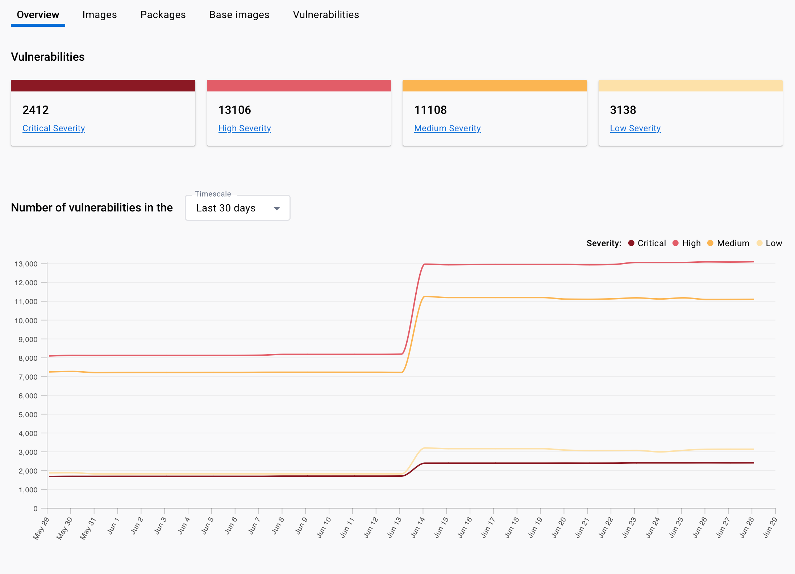
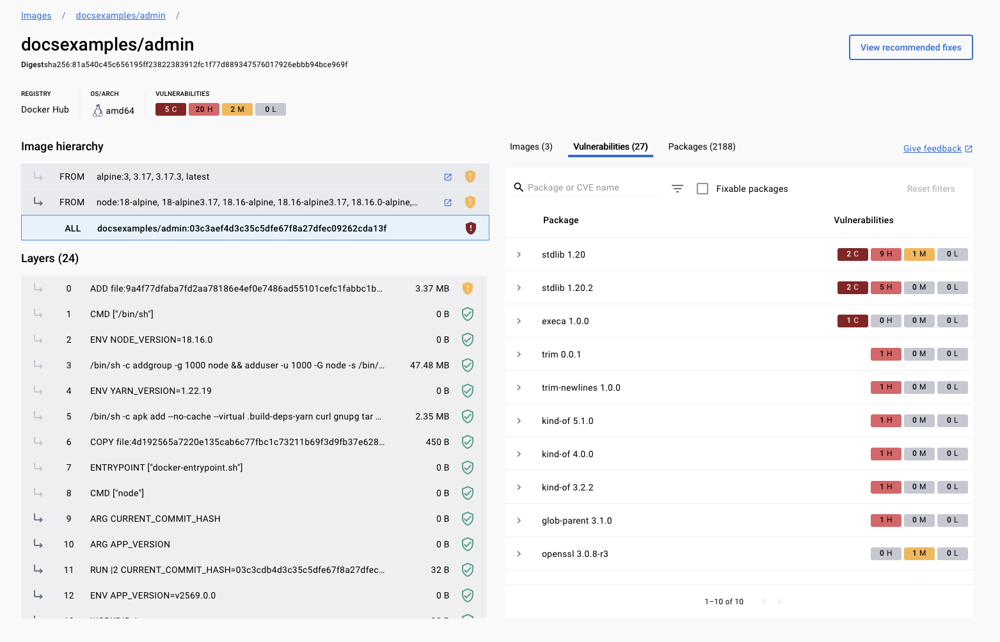


 
The Docker Scout Dashboard helps you share the analysis of images in an organization with your team. Developers can now see an overview of their security status across all their images from both Docker Hub and Artifactory, and get remediation advice at their fingertips. It helps team members in roles such as security, compliance, and operations to know what vulnerabilities and issues they need to focus on.

## Overview

The **Overview** tab shows the total number of vulnerabilities across all your Docker Scout-enabled repositories, over time. This calculation takes the most recent image in each repository to avoid including old irrelevant images.

## Repository settings

Enable Docker Scout analysis on repositories in the current organization by selecting the settings icon next to your user profile picture and then the **Repository settings** menu item.

Select the checkboxes for the repositories on which you want to enable Docker Scout analysis and
select **Enable image analysis**.

When you enable image analysis for a repository, Docker Scout analyzes new tags
automatically when you push to that repository. Find out more in the [Advanced image analysis](./advanced-image-analysis.md) documentation.

Disable Docker Scout analysis on selected repositories by selecting **Disable image analysis**.

## Images

The **Images** tab shows a list of images in an organization. You can search for specific repositories using the search box.

Each entry in the list shows the following details:

- The repository name for the image. Selecting the link for the repository opens [the list of tags for the repository](#repository-tag-list).
- The most recent tag of the image and the vulnerabilities for that version. Selecting the link for the base image opens [the image layer view](#image-layer-view).
- The operating system and architecture of the image.
- The date of the last push for the image.
- The base image and version used by the repository and the vulnerabilities for that version. Clicking the link for the base image opens [the image layer view](#image-layer-view).

  > **Note**
  >
  > Docker Scout detects the base image of an image by matching layer content hashes.
  > However, it's possible for multiple images and tags to be associated with these layers. In these cases, Docker Scout's
  > base image detection might not be precise and potentially return a different tag to the one used in the Dockerfile.

- The recommended fixes, which can include options such as changing tags or rebuilding an image.
- The predicted improvement to the vulnerabilities if you apply the recommended fixes.
- An action button to show implementable recommended fixes.

### Repository tag list

The repository tag list shows all tags for a repository. You can search for specific tag versions using the search box.

Each entry in the list shows the following details:

- A checkbox to mark the tag for comparison to one other.

  > **Tip**
  >
  > Compare two image tags by selecting the checkboxes next to them and selecting the **Compare images** button at the top of the list.
  {: .tip }

- The tag version. Clicking the link for version opens [the image layer view](#image-layer-view).
- The operating system and architecture of the image.
- The vulnerabilities for the tag version.
- The last push for the tag version.
- The base image and version used by the repository and the vulnerabilities for
  that version.
- The size of the image tag.

#### Comparing two tag images

The top section of the comparison view shows an overview of the two selected image tags.

The tabs section of the view shows the following:

- Select the **Packages** tab to see packages added, removed, or changed in each image. Each entry in the table shows the differences between the versions and vulnerabilities in each image. Select the disclosure triangle next to a package to see more detail on the vulnerabilities changed.
- Select the **Vulnerabilities** tab to see changes to the vulnerabilities present in each image.

### Image layer view

The image layer view shows a breakdown of the Docker Scout analysis, including
an overview of the digest Secure Hash Algorithms (SHA), version, the image hierarchy (base images), image
layers, packages, and vulnerabilities.

> **Note**
>
> You can find more details on the elements in the image layer view in [the image details view docs](./image-details-view.md).

Select the **View recommended fixes** button to see instructions to apply the recommended fixes for the image.

## Packages

The **Packages** tab shows all packages across repositories in an organization.

Each entry in the list shows the following details:

- The package name.
- The package type.
- The versions of the package used by images in the organization.
- The number of images that use the package.

## Base images

The **Base images** tab shows all base images used by repositories in an organization.

Each entry in the list shows the following details:

- The base image name.
- The versions of the base image used by images in the organization.
- The number of images that use the base image. Selecting the link opens [the list of images that use the base image view](#images-using-base-image).
- The number of packages in the base image.

### Images using base image

The **Images** tab shows all images in an organization that use a specific base image.

Each entry in the list shows the following details:

- The repository name. Selecting the link opens [the list of tags for the repository](#repository-tag-list).
- The most recent tag of the image and its vulnerabilities. Selecting the link for the tag opens [the Image layer detail view](#image-layer-view) for the repository.
- The operating system and architecture of the image.
- The base image tag used by the repository. Selecting the link opens [the image layer detail view](#image-layer-view) for that version.
- The current base image digest for the repository.
- The date of the last push for the repository.

## Vulnerabilities

The **Vulnerabilities** tab shows a list of all vulnerabilities from images in the organization. You can sort and filter the list by severity and search for Common Vulnerabilities and Exposures (CVE) ID using the search box.

Each entry in the list shows the following details:

- Severity of the vulnerability.

  > **Note**
  >
  > Docker Scout bases the calculation behind this severity level on a variety
  > of sources.

- The severity of the vulnerability.
- The vulnerability CVE ID. Selecting the link for the CVE ID opens [the vulnerability details page](#vulnerability-details-page).
- The package name and version affected by this CVE.
- The Common Vulnerability Scoring System (CVSS) score for the vulnerability. Docker Scout shows the highest CVSS score from multiple sources.
- The number of images in the organization that use the package affected by this CVE. Selecting this link opens the [vulnerability details page](#vulnerability-details-page).
- If Docker Scout knows of a fix for the vulnerability, and if so, the package version of the fix.

### Vulnerability details page

The vulnerability details page shows detailed information about a particular CVE. The page shows the following information:

- The CVE ID and severity.
- A description of the vulnerability.
- The number of packages affected by the vulnerability.
- The vulnerability publish date.

Following this information is a list of all repositories affected by the vulnerability, searchable by image name. Each entry in the list shows the following details:

- The repository name. Selecting the link for the repository name opens [the repository tag list view](#repository-tag-list).
- The current tag version of the image. Selecting the link for the tag name opens [the repository tag list layer view](#image-layer-view).
- The date the image was last pushed.
- The registry where the image is stored.
- The affected package name and version in the image.